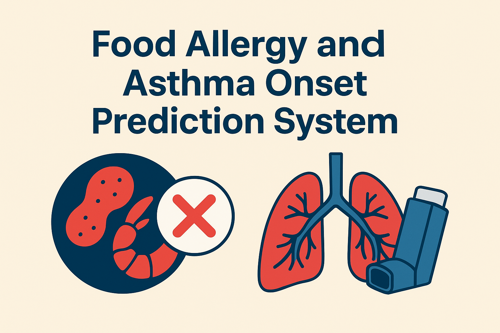

# Food Allergy and Asthma Onset Prediction System



## Description of the Problem

### Background
Food allergies and asthma affect millions of people worldwide and can develop at any age, with some individuals experiencing multiple allergic conditions throughout their lifetime. Understanding patterns of allergy development and asthma onset, particularly in pediatric populations, is crucial for early intervention and preventive care.

### Problem Statement
Healthcare providers need predictive tools to identify patients at risk of developing asthma and estimate when asthma onset might occur. This is a critical healthcare challenge because:

- **Early Detection Saves Lives**: Asthma can be life-threatening, and early identification allows for preventive measures
- **Healthcare Cost Reduction**: Proactive monitoring is more cost-effective than emergency interventions
- **Quality of Life**: Families can prepare and adapt lifestyles before severe asthmatic episodes occur
- **Clinical Decision Support**: Helps allergists and pulmonologists prioritize patients for testing and follow-up care

### Solution Approach

This project implements a two-stage machine learning pipeline:

1. **Asthma Risk Classification**: Predict which patients are likely to develop asthma using XGBoost binary classification
2. **Asthma Onset Age Prediction**: Estimate the age when asthma might manifest using XGBoost regression
3. **Clinical Integration**: Deploy as a Flask web service for healthcare provider use

The solution uses XGBoost for both classification (asthma risk prediction) and regression (age of onset prediction), trained on longitudinal patient data with features engineered from allergy history and demographic information.

### Business Impact
- **For Healthcare Providers**: Evidence-based risk stratification and monitoring schedules
- **For Patients/Families**: Early awareness and preparation for potential asthmatic conditions
- **For Healthcare Systems**: Optimized resource allocation and preventive care protocols

## Instructions on How to Run the Project
### Prerequisites
#### System Requirements
- Python 3.8 or higher
- Docker (for containerization)
- Jupyter Notebook
- 8GB RAM minimum (for XGBoost training)
- 4GB free disk space

### Local Development Setup
#### 1. Environment Setup
```bash
# Create and activate virtual environment
python -m venv food-allergy-analysis_venv
source food-allergy-analysis_venv/bin/activate  # On Windows: food-allergy-analysis_venv\Scripts\activate

# Install dependencies from requirements.txt
pip install -r requirements.txt
```

#### 2. Data Setup
The dataset (`food-allergy-analysis-Zenodo.csv`) is included in the `data/` folder there you will find a comprehensive documentation of each column.

#### 3. Run the Complete Pipeline
**Step 1: Data Analysis and Model Training**
```bash
# Open Jupyter notebook for complete pipeline
jupyter notebook notebook.ipynb
```

**Step 2: Train Models (Optional - models are pre-trained)**
```bash
# Train and save both XGBoost models
python train.py
```

**Step 3: Start the Prediction Service**

**Build the Docker image**

Remain in the **root directory** of the project.

```bash
docker build -t asthma-predictor -f deployment/flask/Dockerfile .
```

**Run the Docker container**
```bash
docker run -it --rm -p 9696:9696 asthma-predictor
```

- This will start the Flask service.
- The API endpoint will be available at: http://localhost:9696/predict.

**Test the service**

1. Navigate to the `deployment/flask` directory:

```bash
cd deployment/flask
```
2. Open and run the `predict_test.ipynb` notebook to test the application.

### Project Structure
```
food-allergy-analysis/
├── README.md                                             # This file
├── notebook.ipynb                                        # Complete data analysis and model development
├── train.py                                              # Training script for both models
├── data/
│   ├── food-allergy-analysis-Zenodo.csv                  # Main dataset
│   └── README.md                                         # Data documentation
├── models/
│   ├── model_xgb_class_eda=0.05_max_depth=6_min_child_weight=30.bin  # XGBoost classification model
│   ├── model_xgb_reg_eda=0.05_max_depth=6_min_child_weight=30.bin    # XGBoost regression model
│   └── README.md                                                     # Model documentation
└── deployment/
    ├── flask/
    │   ├── Dockerfile                                    # Docker container configuration
    │   ├── Pipfile                                       # Pipenv dependencies
    │   ├── Pipfile.lock                                  # Pipenv lock file
    │   ├── predict.py                                    # Flask web service
    │   ├── predict_test.ipynb                            # API testing notebook
    │   └── README.md                                     # Deployment documentation
    └── kubernetes/
        └── README.md                                     # Kubernetes deployment docs
```
